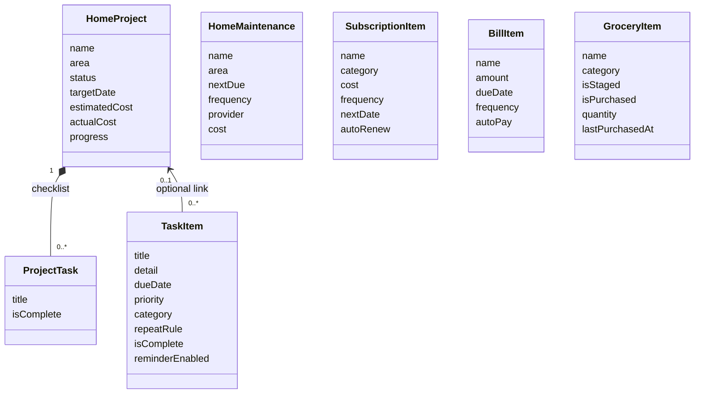

# Daykeeper architecture

## Component diagram

```mermaid
flowchart TD
    App[LifeCommandCenterApp]
    Schema[SwiftData Schema and ModelContainer]
    Store[(On-device SwiftData store)]
    Root[RootView / tab selection]

    App --> Schema
    Schema --> Store
    App --> Root
    Root --> Today[TodayView]
    Root --> Tasks[TasksView]
    Root --> Groceries[GroceriesView]
    Root --> Home[HomeView]
    Root --> Money[SubscriptionsView]
    Today --> More[MoreView: Calendar, Search, Statistics, Settings]

    Today --> Queries
    Tasks --> Queries
    Groceries --> Queries
    Home --> Queries
    Money --> Queries
    More --> Queries
    Queries[@Query reads]
    Mutations[ModelContext inserts and edits]
    Today --> Mutations
    Tasks --> Mutations
    Groceries --> Mutations
    Home --> Mutations
    Money --> Mutations
    Mutations --> Store
    Store --> Queries

    QuickAdd[QuickAddView and item forms]
    Root -->|tab-aware default type| QuickAdd
    QuickAdd --> Mutations
    TaskCompletion[Task completion]
    Tasks --> TaskCompletion
    Today --> TaskCompletion
    TaskCompletion -->|creates next repeat occurrence| Mutations

    ReminderService[NotificationService]
    QuickAdd -->|task and bill reminders| ReminderService
    Tasks -->|cancel completed task reminder| ReminderService
    ReminderService --> UN[UserNotifications framework]
    UN --> Device[Local iOS notification]
```

All features use the same local SwiftData container. Views query the shared store and write through the environment `ModelContext`; there is no repository, API client, or remote persistence layer.

## Data model



`TaskPriority` and `RepeatRule` are Swift enums stored as raw strings on models. Project progress is computed from its checklist tasks. A grocery catalog record also stores the current trip state: `isStaged` controls trip membership, `isPurchased` controls its checkmark/strikethrough, and `quantity` is reset when staging or finishing the trip.

## App entry and persistence

1. `LifeCommandCenterApp` declares the SwiftData schema and creates the on-device `ModelContainer`.
2. The container is injected into `RootView` with `.modelContainer(container)`.
3. `RootView` owns tab selection, routes Quick Add to a tab-specific initial type, and supplies queried model collections to screens.
4. Each feature view renders `@Query` results and mutates models through `ModelContext`.
5. SwiftData persists those changes locally; the app does not manually serialize records or call a server.

Sample household data is inserted once using `@AppStorage` flags. The grocery catalog has its own seed flag so existing installs can receive starter staples once without reseeding the rest of the household.

## Source map

- `LifeCommandCenter/LifeCommandCenterApp.swift`: app entry, SwiftData models and schema, root navigation, sample seeding, recurrence helper, local notification service.
- `LifeCommandCenter/Views.swift`: tabs, dashboard, task and grocery workflows, home/money screens, calendar/search/statistics/settings, Quick Add, and editors.
- `LifeCommandCenter/Assets.xcassets/AppIcon.appiconset/`: Daykeeper app icon.
- `LifeCommandCenter/render_app_icon.swift`: deterministic AppKit script used to render the source app icon PNG.
- `LifeCommandCenter.xcodeproj/`: Xcode application target and build settings.

The current MVP keeps the SwiftUI application in two source files. If the app grows, split models, screens, services, and shared components into the folders described in the source map without changing the ownership of the SwiftData container.

## Extension points

- **CloudKit:** Introduce a versioned schema and migration plan first, then evaluate SwiftData CloudKit configuration and relationship constraints.
- **Richer notifications:** Centralize notification identifiers and update/reschedule requests when model dates or names change.
- **Widgets:** Expose an App Group-backed read model or a supported SwiftData sharing approach; define stale-data behavior for offline widgets.
- **Export/restore:** Add an explicit versioned export format and validate imports before mutating the live store.
- **Testing:** Add model/service tests for recurrence, grocery trip state, derived project progress, and notification request construction.
