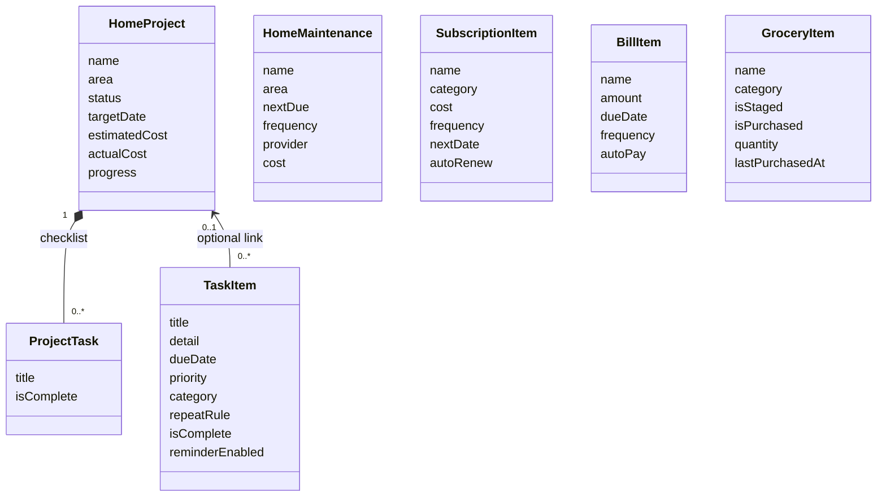

# Home Manager architecture

## Component diagram

```mermaid
flowchart TD
    App[LifeCommandCenterApp]
    Schema[SwiftData Schema and ModelContainer]
    Store[(On-device SwiftData store)]
    Root[App / RootView]
    VM[RootViewModel]
    Repository[Repositories]
    Components[Shared Components]

    App --> Schema
    Schema --> Store
    App --> Root
    Root --> VM
    Root --> Repository
    Root --> Today[TodayView]
    Root --> Tasks[TasksView]
    Root --> Groceries[GroceriesView]
    Root --> Home[HomeView]
    Root --> Money[SubscriptionsView]
    Today --> More[MoreView: Calendar, Search, Statistics, Settings]

    Today --> Queries
    Tasks --> Queries
    Groceries --> Queries
    Home --> Queries
    Money --> Queries
    More --> Queries
    Queries[@Query reads]
    Mutations[Feature edits through ModelContext]
    Today --> Mutations
    Tasks --> Mutations
    Groceries --> Mutations
    Home --> Mutations
    Money --> Mutations
    Mutations --> Store
    Store --> Queries
    Repository --> Mutations

    QuickAdd[QuickAddView and item forms]
    Root -->|tab-aware default type| QuickAdd
    QuickAdd --> Mutations
    TaskCompletion[Task completion]
    Tasks --> TaskCompletion
    Today --> TaskCompletion
    TaskCompletion -->|creates next repeat occurrence| Mutations

    ReminderService[NotificationService]
    QuickAdd -->|task and bill reminders| ReminderService
    Tasks -->|cancel completed task reminder| ReminderService
    ReminderService --> UN[UserNotifications framework]
    UN --> Device[Local iOS notification]
```

All features use the same local SwiftData container. Feature views read through `@Query`; task completion and sample-data seeding are isolated in repositories that write through `ModelContext`. There is no API client or remote persistence layer. Shared visual elements and design tokens live in `Components`.

## Data model



`TaskPriority` and `RepeatRule` are Swift enums stored as raw strings on models. Project progress is computed from its checklist tasks. A grocery catalog record also stores the current trip state: `isStaged` controls trip membership, `isPurchased` controls its checkmark/strikethrough, and `quantity` is reset when staging or finishing the trip.

## App entry and persistence

1. `App/LifeCommandCenterApp` declares the SwiftData schema and creates the on-device `ModelContainer`.
2. The container is injected into `App/RootView` with `.modelContainer(container)`.
3. `RootView` connects tab selection and Quick Add routing to `RootViewModel`, then supplies queried models to feature screens.
4. Feature views render `@Query` results. Task completion and sample-data creation go through repository types; other feature edits use the environment `ModelContext`.
5. SwiftData persists those changes locally; the app does not manually serialize records or call a server.

Sample household data is inserted once using `@AppStorage` flags. The grocery catalog has its own seed flag so existing installs can receive starter staples once without reseeding the rest of the household.

## Source map

```text
LifeCommandCenter/
├── App/                 # App entry point and root navigation
├── Models/              # SwiftData entities and app-wide enums
├── Views/               # Dashboard and feature screens, grouped by feature
├── ViewModels/          # Observable navigation and presentation state
├── Services/            # Local notifications and platform integrations
├── Repositories/        # Persistence workflows and sample data
├── Components/          # Reusable UI, design tokens, and row/card components
├── Assets.xcassets/     # App icons and image assets
└── Tools/               # Development-only asset-generation scripts
Tests/LifeCommandCenterTests/ # XCTest coverage for shared business rules
```

The Xcode project has a separate `LifeCommandCenterTests` unit-test target. `RepeatRuleTests` is the initial test suite; add feature-specific repository and view-model tests alongside it as those layers grow.

- `LifeCommandCenter.xcodeproj/`: app and XCTest targets and shared scheme.
- `ARCHITECTURE.md`: component diagram, model relationships, and data flow.
- `Docs/HOW_TO_USE.md` and `Docs/screenshots/`: end-user quick guide and screenshots.

## Extension points

- **CloudKit:** Introduce a versioned schema and migration plan first, then evaluate SwiftData CloudKit configuration and relationship constraints.
- **Richer notifications:** Centralize notification identifiers and update/reschedule requests when model dates or names change.
- **Widgets:** Expose an App Group-backed read model or a supported SwiftData sharing approach; define stale-data behavior for offline widgets.
- **Export/restore:** Add an explicit versioned export format and validate imports before mutating the live store.
- **Testing:** Add model/service tests for recurrence, grocery trip state, derived project progress, and notification request construction.
