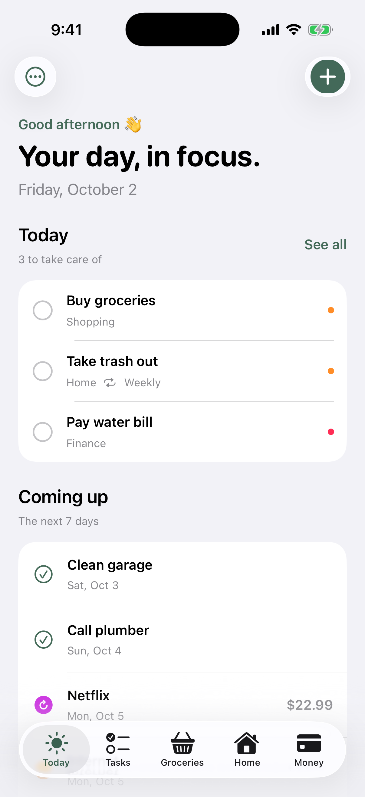
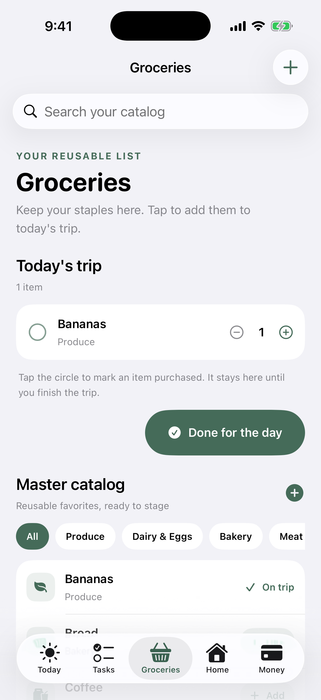
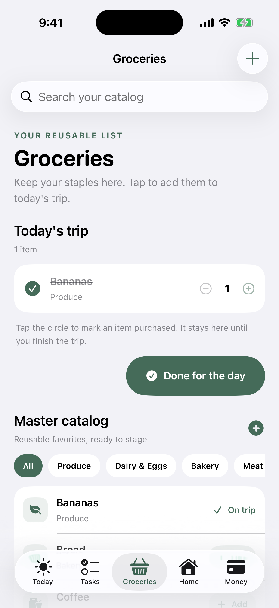
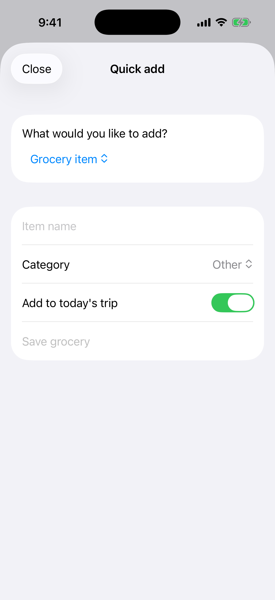

# Daykeeper quick guide

This guide covers the everyday actions in Daykeeper. Screenshots show the iPhone simulator with sample data.

## Find your way around

Use the five tabs at the bottom:

- **Today** is your daily overview.
- **Tasks** holds your open and completed to-dos.
- **Groceries** is your reusable grocery catalog and today's shopping list.
- **Home** holds maintenance and home projects.
- **Money** holds subscriptions and bills.

Tap the **+** in a tab to open Quick Add. It starts with the matching item type: Task on Today or Tasks, Grocery item on Groceries, Maintenance on Home, and Subscription on Money. Choose a different type from the picker when you need one. Calendar, Search, Statistics, and Settings are under the **…** button on Today.

## Manage tasks

1. Tap **+** on Today or Tasks.
2. Enter a title, then adjust the due date, category, priority, repeat schedule, or reminder if needed.
3. Tap **Save Task**. Use the circle beside a task to complete it. For recurring tasks, completing an occurrence creates the next one.
4. Tap a task to edit it. In Tasks, switch between Open and Completed; swipe a row to delete it.

## Plan today's shopping

The **Master catalog** is reusable. Starter staples such as milk, eggs, rice, bread, bananas, and coffee are already there.

1. In **Groceries**, tap **Add** next to an item to put it on **Today's Shopping**. Tap the item row to stage it as well.
2. To add a new staple, tap the **+** at the right of the Master catalog heading. The Grocery item form is selected automatically. Enter its name and category; **Add to today's shopping** is on by default.
3. Tap the sliders icon beside the Master catalog heading for all category actions in one place: create a category, reorder rows, rename with the pencil (existing items update too), or delete with the trash button and confirmation (items move to **Other**). **Other** is protected and always stays last. The filter chips, grocery category picker, and items shown under **All** follow the saved order.
5. In **Today's Shopping**, use the filter and sort icons at the right of the heading to filter staged items or show them by name/category order.
6. Use **−** and **+** beside a staged item to change its quantity. Pressing **−** at quantity 1 asks for confirmation before removing it from today's shopping; it stays in the catalog.
7. Tap the check circle or the item name to mark it purchased. It stays on the list with a strikethrough. Tap either again to undo an accidental mark.
8. When you're finished, tap **Done Shopping**. Every item must be checked first; any unchecked items are outlined in red. Once all are checked, the list clears and a short confetti celebration appears.

## Look after your home

1. Open **Home** and tap **+** to add maintenance. Enter the item, area, next due date, and frequency.
2. To create a larger project, tap **+**, select **Project**, and add the project tasks one per line.
3. Check off project tasks on the project card. Progress updates from the completed task count.
4. From a maintenance row's context menu, mark the item complete to advance its next due date by its selected frequency.

## Track bills and subscriptions

1. In **Money**, tap **+** to add a subscription. Enter its name, price, billing frequency, and next renewal date.
2. To add a bill, open Quick Add's type picker and choose **Bill**. Add its amount and due date; turn on **Remind me** if you want a local alert.
3. The Money screen shows upcoming bills, renewal dates, monthly and annual subscription totals, and a category chart.

## Personalize Daykeeper

Open **… → Settings** from Today to set your preferred name, appearance, app accent color, text size, default task priority, and notification permission. Your name appears in the time-of-day greeting and in newly scheduled reminders. Calendar dates with scheduled items show a dot beneath the date.

## Your data

Daykeeper saves items on this iPhone with SwiftData. It does not require an account or send your personal information to a server. Use a device backup to protect data; in-app export and restore are not available in this release.
